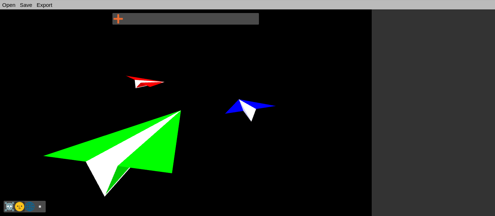
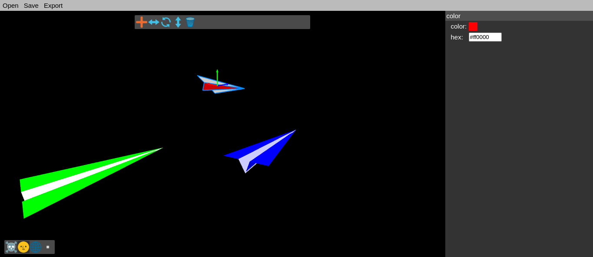

# Info

3D modeling tool I made with ThreeJS as I didn't really like Blender and didn't want to spend money and time researching other options.

In a demo stage currently, it can't even save, open, or export files yet, and a few more tools are needed for this to be useful for me.

The goal of this project is to create a 3D modeling tool that's easier to learn than Blender and powerful enough for decent models in simple 3D games. Also, I might implement parts of this project into my collaborative editor [JoshDevelop](https://github.com/arthurcose/joshdevelop)

# Building

* Install node/npm
* Run `npm install`
* Now using `npm run build` will create builds in the "build" folder

# Controls

Basic controls:
* Click: Select vertex/face
* CTRL + Click: Select without resetting the selection

Select three vertices to create a face, the rest of the controls should be intuitive.

# Future Plans

* Animation tools
* Extrude tool
* Separate Faces tool
* Loop cut tool
* Undo/Redo
* Save/Open/Export

# Screenshots

